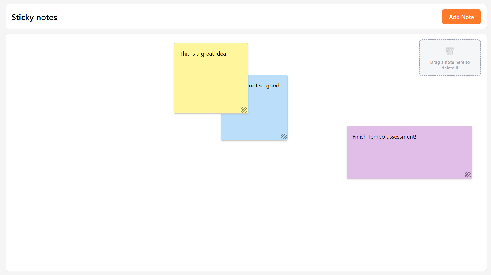

# Sticky Notes



Sticky Notes is a single-page web application for creating, moving, resizing and deleting sticky notes on a board. It is built with React and TypeScript, without stock UI components.

## Features

### Required

- **Create a note of a specified size at a specified position:** click "Add Note", then drag on the board to draw the note. A dashed preview follows the pointer. If the drawn note is smaller than the minimum size (150x150px), it grows to that size when created, so a plain click creates a minimum-size note at that point. Press Esc or "Cancel" to stop adding. New notes open in edit mode, ready for typing.
- **Resize a note by dragging:** drag the handle in the bottom-right corner. Notes can't get smaller than the minimum size or extend past the board.
- **Move a note by dragging:** drag the note anywhere on the board. It stays inside the board.
- **Remove a note by dragging it to the trash zone:** drop a note on the trash zone to delete it. The zone is highlighted while the pointer is over it.

### Bonus

- **Enter and edit note text:** double-click a note, press Enter or Space while it has focus, or use the ✏️ action. Clicking outside the note saves the text; Escape or ✖️ discards the changes.
- **Change stacking order:** move a note to the front or back, or one layer forward or backward, from the note's actions toolbar.

### Extra

- **Note colours:** choose from a palette of five colours.
- **Persistence:** notes are saved in `localStorage` and restored when the page reloads.
- **Keyboard and accessibility support:** notes can be focused with the keyboard and dismissed with Escape. Action buttons have tooltips and ARIA attributes.

## System requirements

- Built for desktop use, with a minimum screen resolution of 1024x768. Below that size the board stops shrinking and the browser shows scroll bars.
- Supported browsers: the latest versions of Google Chrome (Windows and Mac), Mozilla Firefox (all platforms) and Microsoft Edge.

## This to improve with more time / usage of 3rd party libraries

- I'd probably use a 3rd party tool to position Sticky Note Actions, like `floating-ui`. I also see that it does not work perfectly (tooltips).
- I'd improve the edit note process. It works well, but probably it can be improved.
- I'd use icons (like Material Icons or similar) instead of emojis.
- I've enjoyed working on this, so had some features that I wanted to add!

## Technologies

- React.js.
- TypeScript.
- Vite.
- Zustand.
- CSS Modules.
- Vitest + React Testing Library.
- Storybook.
- ESLint.

## How to run it

You need [Node.js](https://nodejs.org/) and [pnpm](https://pnpm.io/). npm also works.

```bash
pnpm install
pnpm dev
```

Open the URL printed by Vite (by default [http://localhost:5173](http://localhost:5173)).

## Available scripts

#### `pnpm dev`

Runs the app in development mode with Vite. The page reloads when you make changes.

#### `pnpm build`

Type-checks the project and builds the app for production into the `dist` folder.

#### `pnpm preview`

Serves the production build locally.

#### `pnpm test`

Runs the unit and functional tests (Vitest + React Testing Library, in jsdom).

#### `pnpm test:watch`

Runs the unit tests in watch mode.

#### `pnpm test:storybook`

Runs the Storybook stories as tests in a headless Chromium browser (Playwright).

#### `pnpm test:all`

Runs all test projects.

#### `pnpm storybook`

Opens Storybook at [http://localhost:6006](http://localhost:6006).

#### `pnpm build-storybook`

Builds a static version of Storybook.

#### `pnpm lint`

Lints the code with ESLint.

## Architecture

The code is organised by feature: everything related to sticky notes is in `src/features/sticky-notes`, split into `components`, `store`, `models` and `constants`. The note data (id, content, colour, size and an `x/y/z` position) lives in a single Zustand store. The store holds the domain logic: creating and deleting notes, updating them, and managing stacking order. Stacking order is always kept as the contiguous sequence 1..n, so "move one step" always swaps with the neighbouring note and z-indexes never keep growing. The store is persisted to `localStorage` with Zustand's `persist` middleware.

The idea was to create all functionality inside features folder, supposing that we are in a bigger frontend application, and we want to separate logic by domains. At any point, if any of the components / state / constants is needed to be used in multiple parts of the application, not only in sticky-notes domain, it will be moved to a generic folder in src (for example, src/constants). Doing that way, we decouple logic between different domains.

The UI is split into small components. `StickyNoteWrapper` is the board: it adds notes and owns the trash zone. `StickyNote` renders a single note, `StickyNoteActions` is its floating toolbar and `StickyNoteActionsColorPalette` is the colour picker. The interaction logic is kept in custom hooks so the components stay declarative and the behaviour can be tested on its own. `useStickyNoteDrag`, `useStickyNoteResize` and `useStickyNoteDraw` (drawing new notes on the board) use Pointer Events with pointer capture. `useDismissibleFocus` handles clicking outside the note and pressing Escape. `useStickyNoteActionsPlacement` flips the toolbar below the note when there isn't room for it above.

Performance was a main design goal. While a note is being dragged or resized, its position and size are kept only in the component's local state, so each pointer move re-renders that one note. The store, and with it `localStorage`, is updated once when the gesture ends. Drags only start after a small movement threshold, so clicks and double-clicks aren't mistaken for drags. Deletion checks whether the pointer is over the trash zone using its bounding box. The board is told about drag movement through callbacks, so notes don't depend on the trash zone directly.

## 3rd party libraries

### Runtime

- [react](https://react.dev/): JavaScript library for building user interfaces.
- [zustand](https://zustand.docs.pmnd.rs/): small state manager, used with its `persist` middleware.
- [nanoid](https://github.com/ai/nanoid): unique id generator for notes.

### Build tool

- [vite](https://vite.dev/).

### TypeScript

- [typescript](https://www.typescriptlang.org/): typed superset of JavaScript that compiles to plain JavaScript.

### Component visualisation

- [storybook](https://storybook.js.org/): tool for developing UI components in isolation.

### Testing

- [vitest](https://vitest.dev/): test runner.
- [React Testing Library](https://testing-library.com/docs/react-testing-library/intro/): functional tests for components.

### Linting

- [eslint](https://eslint.org/): code linter.
